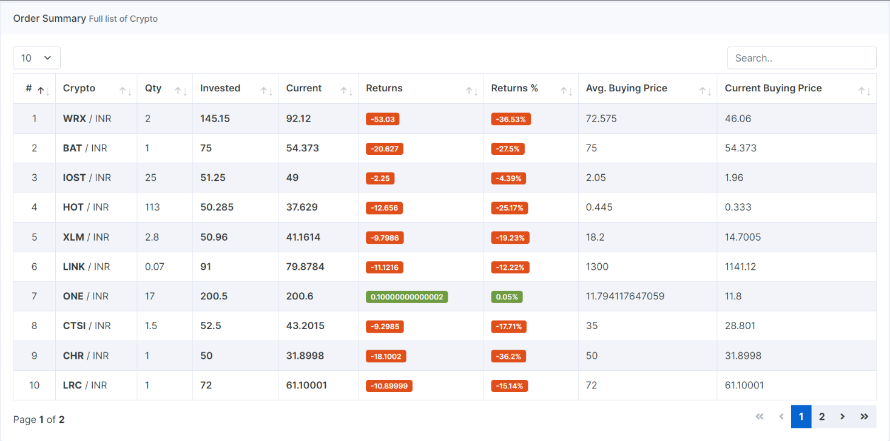

# WazirX Portfolio Tracker

**Free and open source solution to track your Wazirx Portfolio.**  

Are you using WazirX for cryptocurrency trading? If yes, then you know that it only provides the list of crypto that you hold with quantity but did not tell you, that you are in a profit or lose or how your portfolio is doing overtime.  
So you can use this tool to get that details.

Oh, that's great but for this do I have to spin a server and install it?  
If you want you can do that but you can use [this link](https://www.webhat.in/wazirx-portfolio-tracker/), where I have already made it accessible for all the non-technical people.

### Features include:

Track all your crypto assets growth of WazirX exchange in one go. You can filter it or order/sort it based on profit, amount spend, etc.  

Oh, that's great, but I think it is missing this thing, or if you can add this it will make much more sense.  
Sure, please let me know [here](https://github.com/finallyRaunak/wazirx-portfolio-tracker/discussions/new?category=ideas) so that I can review and see how it can be incorporated.

### Why this?

It is a simple tool to take a quick snap of your portfolio.

## Demo

- You can see a live preview from [here](https://www.webhat.in/wazirx-portfolio-tracker/)
- You can also check this [screenshot](screenshots/full-page-view.png)

## Installation

- Download the zip
- Extract the zip
- From CLI cd to the extracted dir
- run `composer install --no-dev`
- Update the `BASE_URL` in `src/constants.php` file.
- Now Navigate to your site (_which you have defined in `BASE_URL`_) and see the report.

## Donate

Like it? considering donating a few dollars (_even 1 USDT_) keeps us motivated to build such a tool that can ease up your crypto journey.  
You can donate to the below given address.

| Currency | Network | Address                                      |
|----------|---------|----------------------------------------------|
| ETH      | BEP20   | `0x162AB205bb9fac0e423F31C7e5E974E649E5980c` |
| BUSD     | BEP20   | `0x162AB205bb9fac0e423F31C7e5E974E649E5980c` |
| USDT     | ERC20   | `0x162AB205bb9fac0e423F31C7e5E974E649E5980c` |
| USDT     | BEP20   | `0x162AB205bb9fac0e423F31C7e5E974E649E5980c` |
| USDT     | TRC20   | `TQVWzF8iXmYSwNmAkBNfKMpv9YwRjSWXtq`         |

## Disclaimer 

- This is an unofficial WazirX Portfolio Tracker which enhances the wallet user experience. The brand and copyright of the word "WazirX" belong to WazirX (https://wazirx.com).
- I do not recommend that any cryptocurrency should be bought, sold, or held by you. Do conduct your due diligence and consult your financial advisor before making any investment decisions.

## License

wazirx-portfolio-tracker is licensed under the MIT License - see the [LICENSE](LICENSE) file for details.